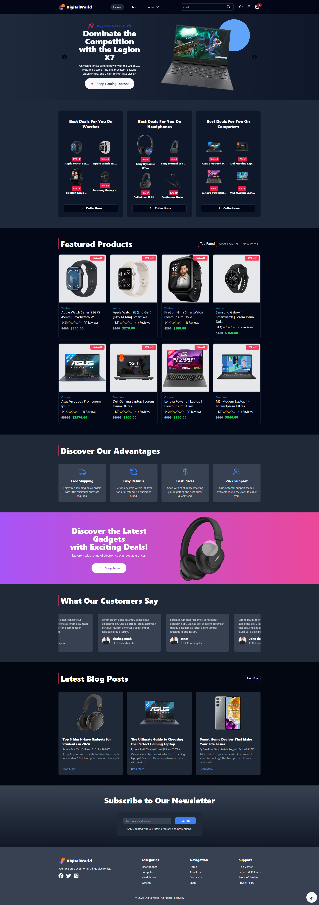
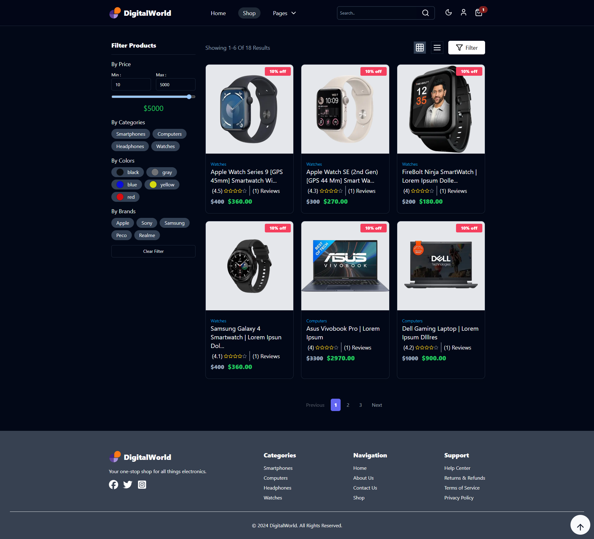
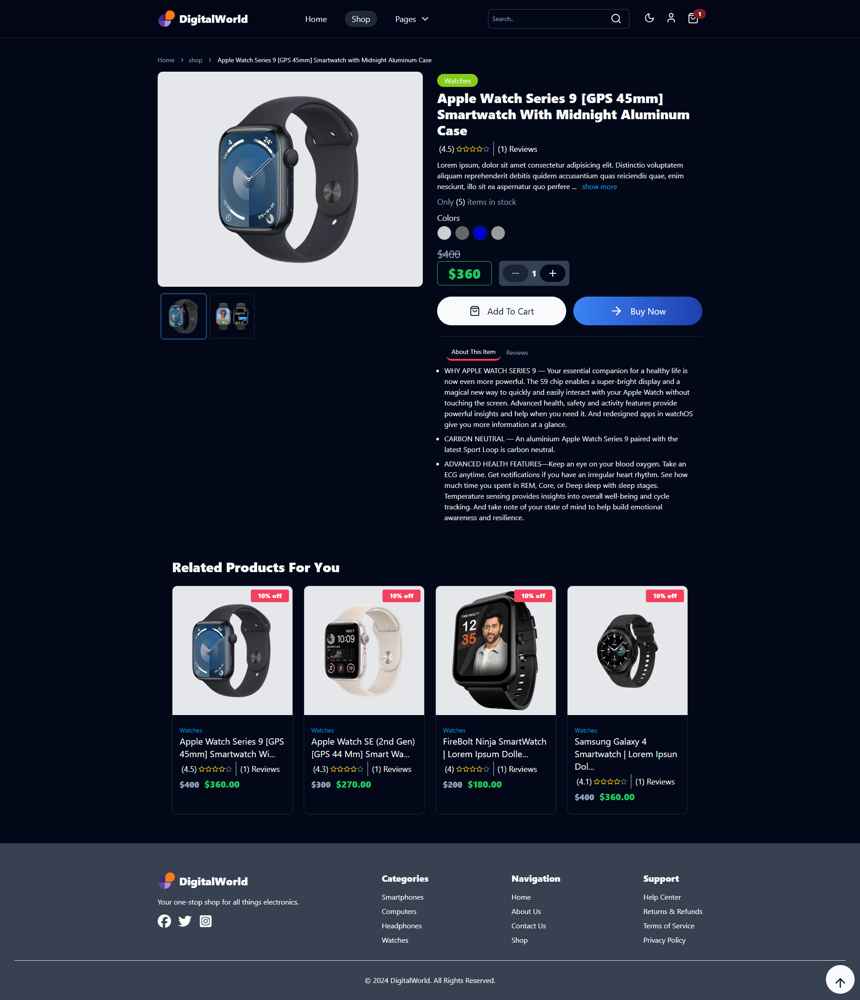
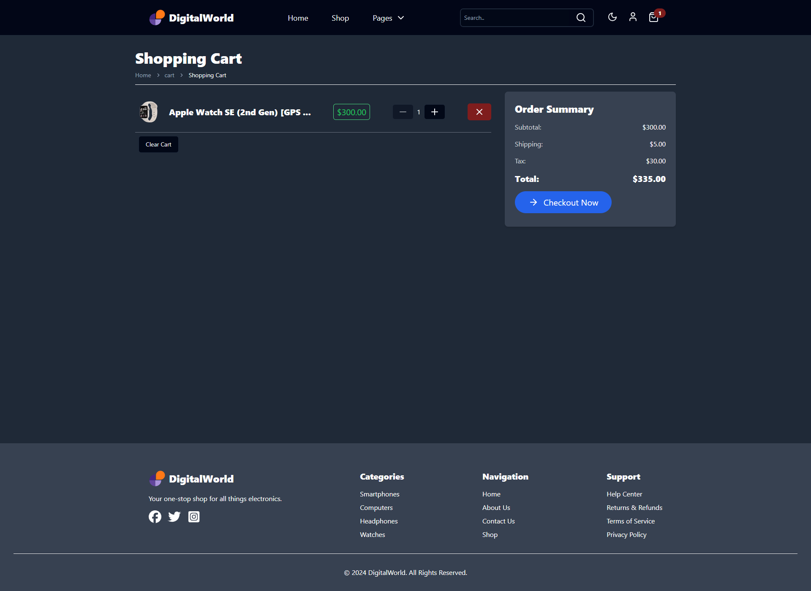

This is a [Next.js](https://nextjs.org/) project bootstrapped with [`create-next-app`](https://github.com/vercel/next.js/tree/canary/packages/create-next-app).

## Getting Started
You should have nodejs and npm installed on your machine .


First, run the development server:


```bash
npm run dev
```

Open [http://localhost:3000](http://localhost:3000) with your browser to see the result.


This project uses [`next/font`](https://nextjs.org/docs/basic-features/font-optimization) to automatically optimize and load Inter, a custom Google Font.

## Building for Production
Run the following commands to build for Production:
```bash
npm run build
```
And them:
```bash
npm run start
```
## Screenshots


---


---


---


